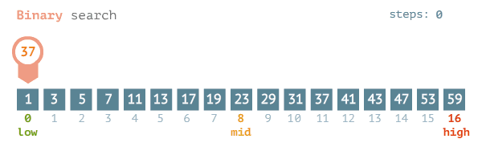
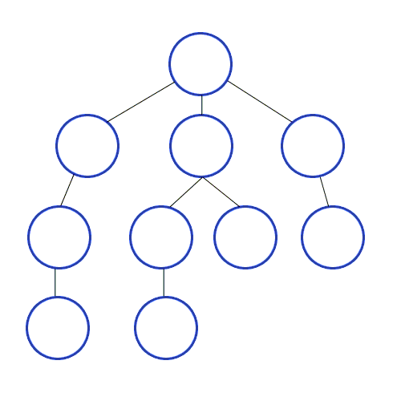
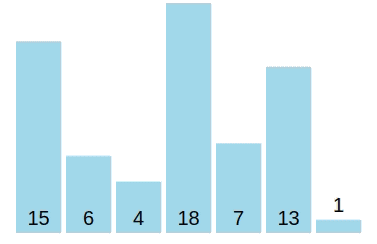
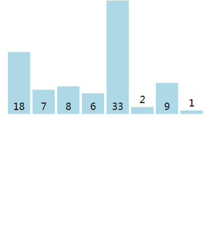

# Data Structures & Algorithms with Go
Data Structures, Algorithms with Golang

## Searching

### [Linear Search](searching/linear.go)

Linear search or sequential search sequentially checks each element of the list until a match is found or the whole list has been searched.

* Worst-case performance O(n)
* Best-case performance O(1)
* Average performance O(n/2)

### [Binary Search](searching/binary_1.go)

Binary search finds the position of a target value within a sorted array.

* The search process initiates by locating the middle element of the sorted array of data
* After that, the key value is compared with the element
* If the key value is smaller than the middle element, then searches analyses the upper values to the middle element for comparison and matching
* In case the key value is greater than the middle element then searches analyses the lower values to the middle element for comparison and matching

Binary Search Algorithm can be implemented in two ways:
1. [Iterative Method](searching/binary_2.go)
1. [Recursive Method](searching/binary_3.go)

* Worst-case performance O(log n)
* Best-case performance O(1)
* Average performance O(log n)

### [Depth First Search](searching/dfs.go)

Search algorithms are what allow us to traverse the entire graph or tree from a single starting point.

As the name suggests, Depth first search (DFS) algorithm starts with the initial node (source or starting node) of the graph, and then goes to deeper and deeper until we find the goal node or the node which has no children. The algorithm, then backtracks from the dead end towards the most recent node that is yet to be completely unexplored.

DFS uses Stack to find the shortest path.

DFS is faster than BFS.

* Worst-case performance O(V+E) where V is the number of vertexes and E is the number of edges
* Best-case performance O(1)

### [Breadth First Search](searching/bfs.go)

Breadth first search (BFS) algorithm starts with the initial node (source or starting node) of the graph, and explores all of the neighbor nodes at the present depth prior before moving on to the nodes at the next depth level.

BFS uses Queue to find the shortest path.

* Worst-case performance O(V+E) where V is the number of vertexes and E is the number of edges
* Best-case performance O(1)

## Sorting

### [Bubble Sort](sorting/bubble.go)

* Worst-case performance O(n^2)
* Best-case performance O(n)
* Average performance O(n^2)

### [Insertion Sort](sorting/insertion.go)

* Worst-case performance O(n^2)
* Best-case performance O(n)
* Average performance O(n^2)

### Selection Sort

### Heap Sort

### Quick Sort

### Merge Sort

### Counting Sort

